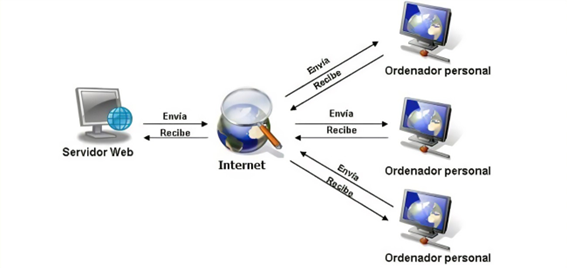

# Evaluación inicial

1. ¿Qué es una página web?

    __Una página web es un documento digital que se puede visualizar a través de un navegador de internet (como Google Chrome, Firefox o Safari) utilizando una dirección web o URL. Las páginas web son la unidad básica de la World Wide Web (WWW) y suelen estar formadas por texto, imágenes, videos, enlaces y otros elementos interactivos.__


2. ¿Qué es un servidor web?

    __Un servidor web es un sistema informático que almacena, procesa y distribuye páginas web a los usuarios a través de Internet. En términos más simples, es el software y hardware responsable de entregar el contenido de un sitio web cuando alguien lo solicita desde un navegador.__


3. ¿Qué son los lenguajes de marcas? ¿Cuántos conoces?.

    __Los lenguajes de marcas son sistemas de codificación que utilizan etiquetas o "marcas" para definir y estructurar el contenido de documentos o datos. Se emplean principalmente para describir cómo se deben presentar o estructurar los datos, en lugar de ejecutar operaciones o cálculos como lo hacen los lenguajes de programación.__

|Nombre|Enlace a documentación|
|:------:|:----------:|
|HTML (HyperText Markup Language)|[Documentación HTML](https://developer.mozilla.org/es/docs/Web/HTML "Documentación XML")|
|XML (extensible Markup Language)|[Documentación XML](https://www.w3.org/XML/ "Documentación XML")|
|Markdown|[Documentación Markdown](https://markdown.es/ "Documentación Markdown")|
|...|...|


4. ¿Qué es HTML ? ¿Sabes cómo se estructura?

    __HTML (HyperText Markup Language) es un lenguaje de marcas utilizado para crear la estructura y el contenido de las páginas web. Prinicpalmentes e estructura en un head y un body.__
```
<!DOCTYPE html>
<html lang="en">
<head>
    <meta charset="UTF-8">
    <meta name="viewport" content="width=device-width, initial-scale=1.0">
    <title>Document</title>
</head>
<body>
    
</body>
</html>
```

__*Figura 1: Estructura de código HTML*__


5. ¿Qué es CSS?

    __CSS (Cascading Style Sheets) es un lenguaje utilizado para describir la presentación y el diseño visual de una página web__

6. ¿Sabes cómo funciona un navegador web? Describe brevemente el proceso que se sigue para visualizar una página web.:

    __Un navegador web es una aplicación que permite a los usuarios acceder y visualizar páginas web en Internet. EL proceso que sigue es el siguiente: El usuario ingresa una URL en el navegador.El navegador solicita al servidor DNS la IP correspondiente al dominio.Con la IP, el navegador envía una solicitud HTTP/HTTPS al servidor. El servidor responde con los archivos HTML, CSS y JavaScript. El navegador interpreta y renderiza los archivos, mostrando la página web.__



_Figura 2: Esquema de peticiones HTML_


